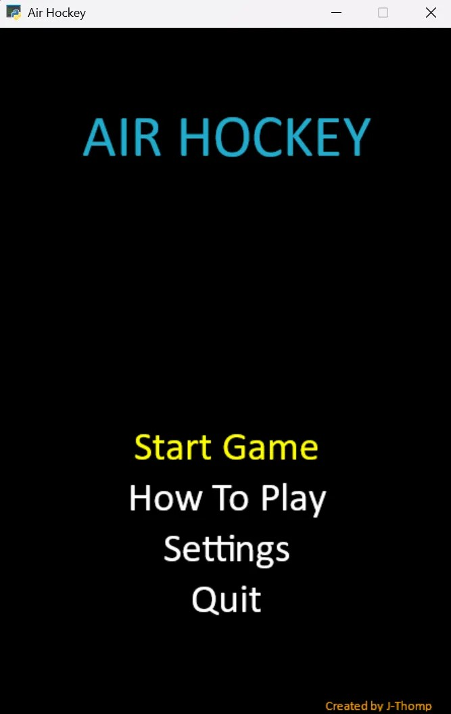
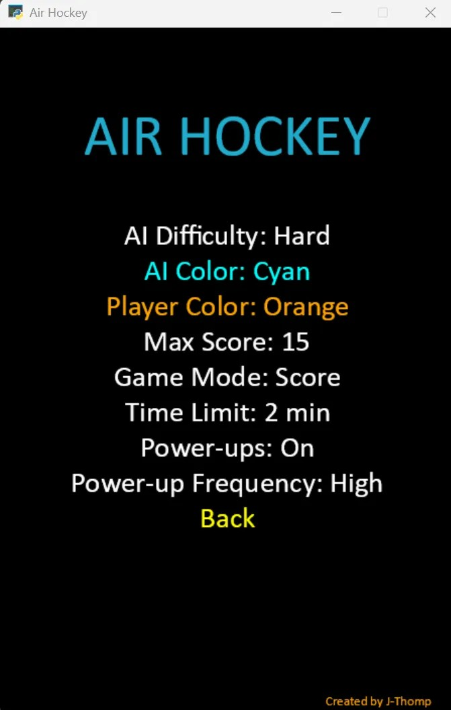
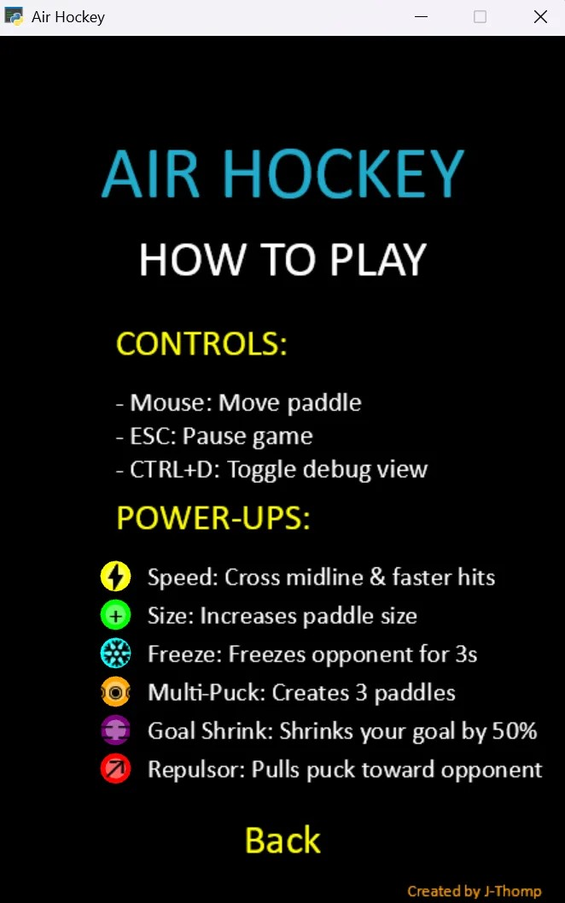

# Air Hockey

A fast-paced 2D air hockey game built with Python and the Arcade library. Play against an AI opponent with customizable difficulty levels, various power-ups, and game settings.

## Screenshots

### Main Menu

*The main menu allows you to start a game, view how to play instructions, adjust settings, or quit.*

### Game Settings

*Customize AI difficulty, colors, scoring rules, time limits, and power-up settings.*

### How To Play

*Learn the controls and understand the various power-ups available in the game.*

### Gameplay

*The game in action, showing the hockey rink, paddles, puck, and power-ups.*

## Features

- **Customizable Settings**:
  - Three AI difficulty levels: Easy, Medium, Hard
  - Customizable paddle colors
  - Adjustable scoring limits and time limits
  - Toggle power-ups on/off with frequency settings

- **Power-ups**:
  - **Speed ⚡**: Cross midline & increase puck speed on hits
  - **Size +**: Increases paddle size
  - **Freeze ❄**: Freezes opponent for 3 seconds
  - **Multi-Puck ◉◉◉**: Creates 3 paddles side by side
  - **Goal Shrink ⊏⊐**: Shrinks your goal by 50% (strategic advantage)
  - **Repulsor ↗**: Pulls puck toward opponent's goal

## Controls

- **Mouse**: Move paddle
- **ESC**: Pause game
- **Ctrl+D**: Toggle debug view

## Requirements

- Python 3.x
- Arcade library

## Installation

1. Clone this repository:
   ```
   git clone https://github.com/yourusername/air-hockey.git
   cd air-hockey
   ```

2. Install the required dependencies:
   ```
   pip install arcade
   ```

3. Run the game:
   ```
   python main.py
   ```

## Game Structure

- **main.py**: Main game loop and window management
- **constants.py**: Game constants and configuration values
- **game_objects.py**: Core game objects (Puck, Paddle)
- **power_ups.py**: Power-up functionality
- **game_states.py**: Menu system and game state management
- **utils.py**: Helper functions

## Credits

- Created by J-Thomp
- Built with [Python Arcade](https://arcade.academy)

## License

This project is licensed under the MIT License - see the LICENSE file for details.